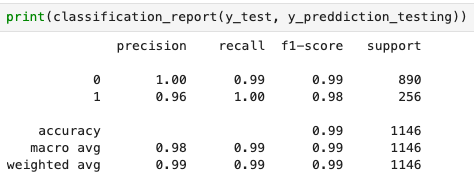
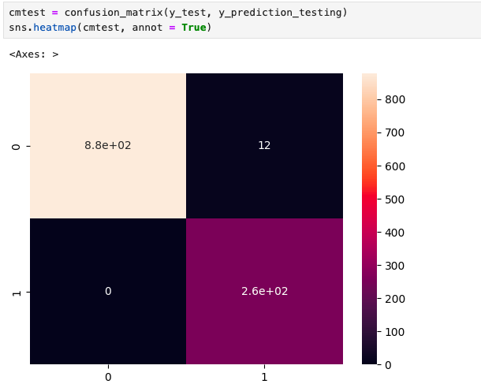
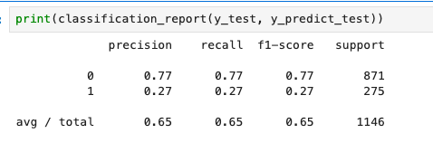
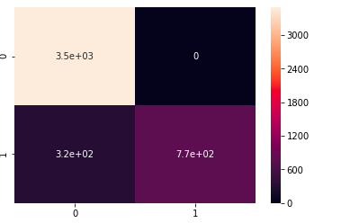

# Results

**Classification Report:**

# ✅ Accuracy: ~99%
- The model performs exceptionally well at distinguishing spam from legitimate messages.

 # Visualization

- This heatmap clearly shows that most messages are correctly classified, with very few misclassifications.

# Spam E-Mail Detection using Naive Bayes

- This project demonstrates how to detect spam messages using a Naive Bayes classifier with both Bag-of-Words (CountVectorizer) and **TF-IDF vectorization** approaches.
- It uses the SMS Spam Collection Dataset, which contains 5,574 SMS messages labeled as either ham (legitimate) or spam.
- The main goal is to build a machine learning model that can automatically identify spam based on message content.
  ## Dataset
- Source: SMS Spam Collection Dataset
- Total messages: 5,574
- Language: English

# Libraries used : 
- pandas – for loading, cleaning
- numpy –  array manipulation.
- matplotlib –  charts and plots.
- seaborn – confusion matrix heatmap.
- scikit-learn (sklearn) – used for:
  - CountVectorizer and TfidfVectorizer to convert text messages into numerical feature vectors.
   - train_test_split to divide the data into training and testing sets.
   - MultinomialNB for implementing the Naive Bayes.
   - classification_report and confusion_matrix for evaluating model performance.

  
**Labels:**
 - ham → legitimate messages
 - spam → unsolicited or junk messages
- Each message is preprocessed, tokenized, and converted into a numerical format for model training.
  ## Model Overview
- The model uses a Multinomial Naive Bayes classifier, a popular algorithm for text classification problems such as spam detection.

**Steps:**
- Data Cleaning – each message is cleaned using a custom message_cleaning() function.
- Vectorization – converting text into numerical features using CountVectorizer.
- Model Training – fitting the Naive Bayes classifier on the training set.
- Evaluation – using metrics like precision, recall, F1-score, and a confusion matrix.

# TF-IDF Approach

**Performance (TF-IDF):** 

- Accuracy: ~65%
This drop suggests that TF-IDF may have required further parameter tuning (e.g., smoothing, min_df, max_df) or additional text preprocessing.

# Visualization 

- The confusion matrix above illustrates how well the model performs in distinguishing between spam and ham messages using the TF-IDF approach.

## Future Improvements
- Experiment with TfidfVectorizer parameters (ngram_range, max_df, min_df)
- Try alternative classifiers like Logistic Regression, SVM, or Random Forest
- Implement lemmatization and stopword removal
